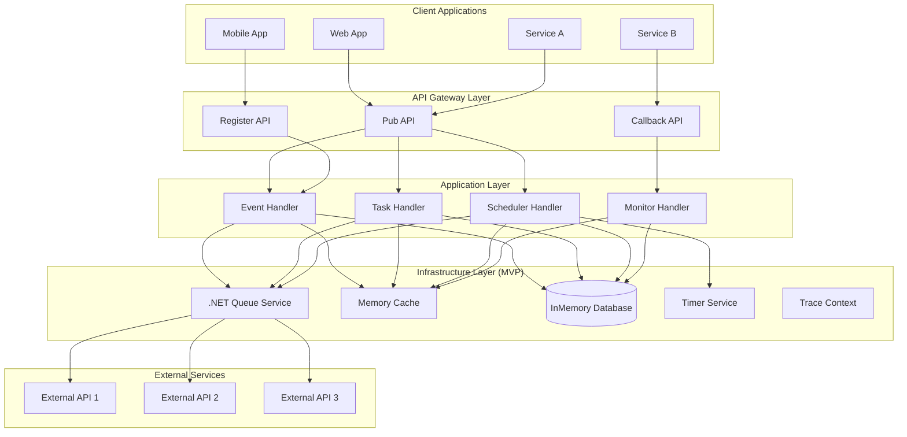
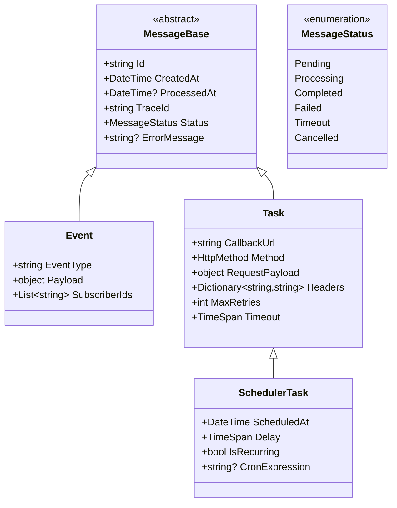
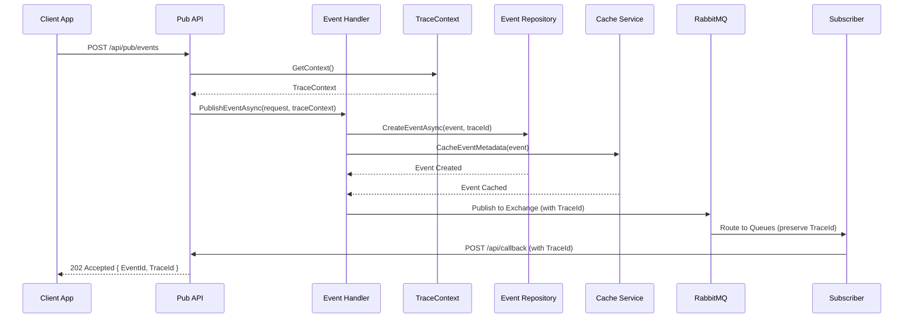
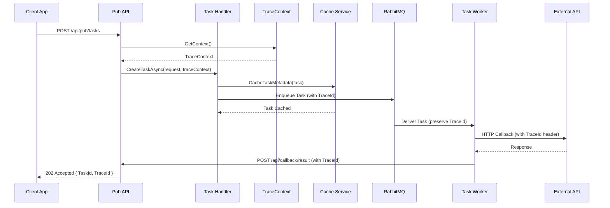
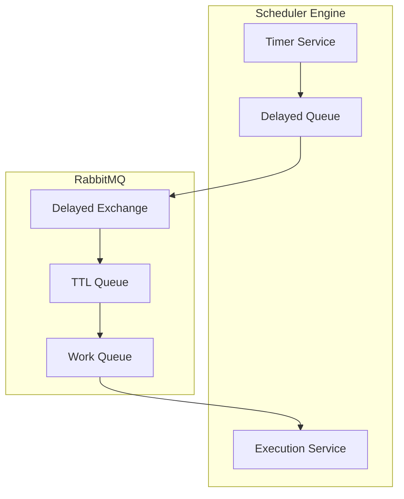
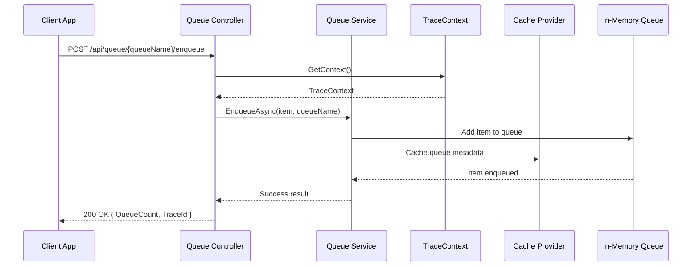
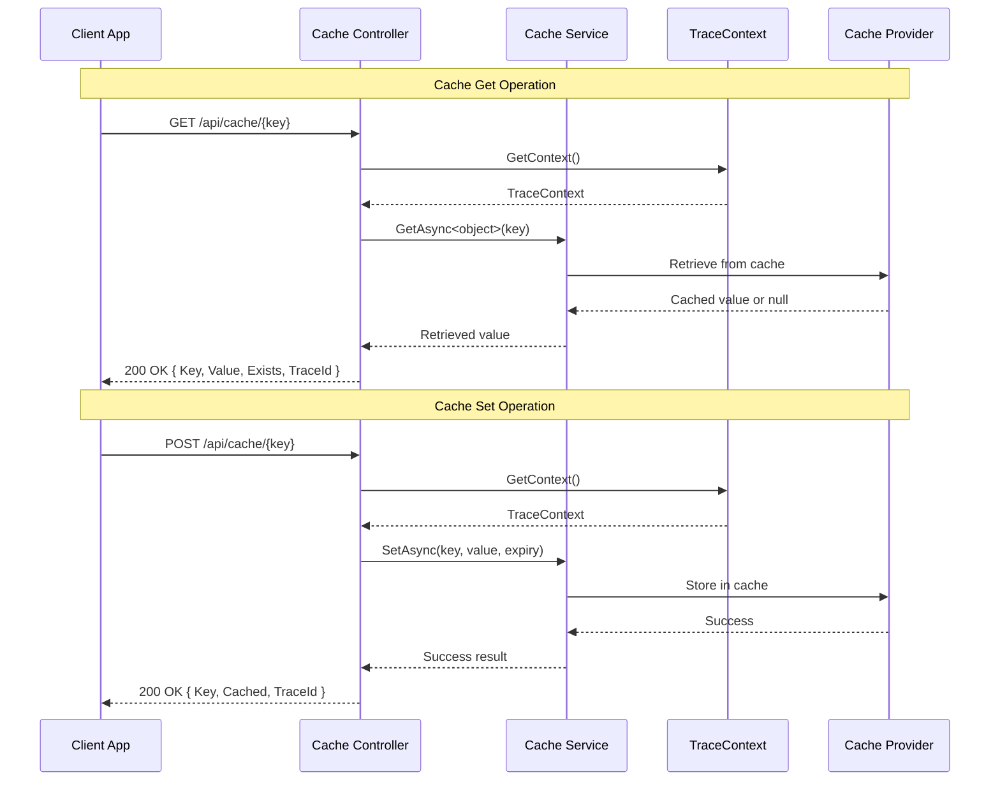
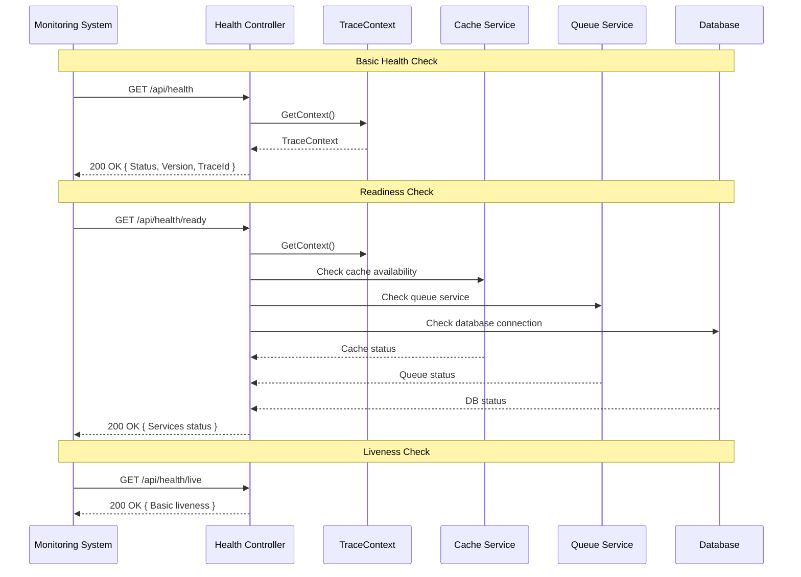
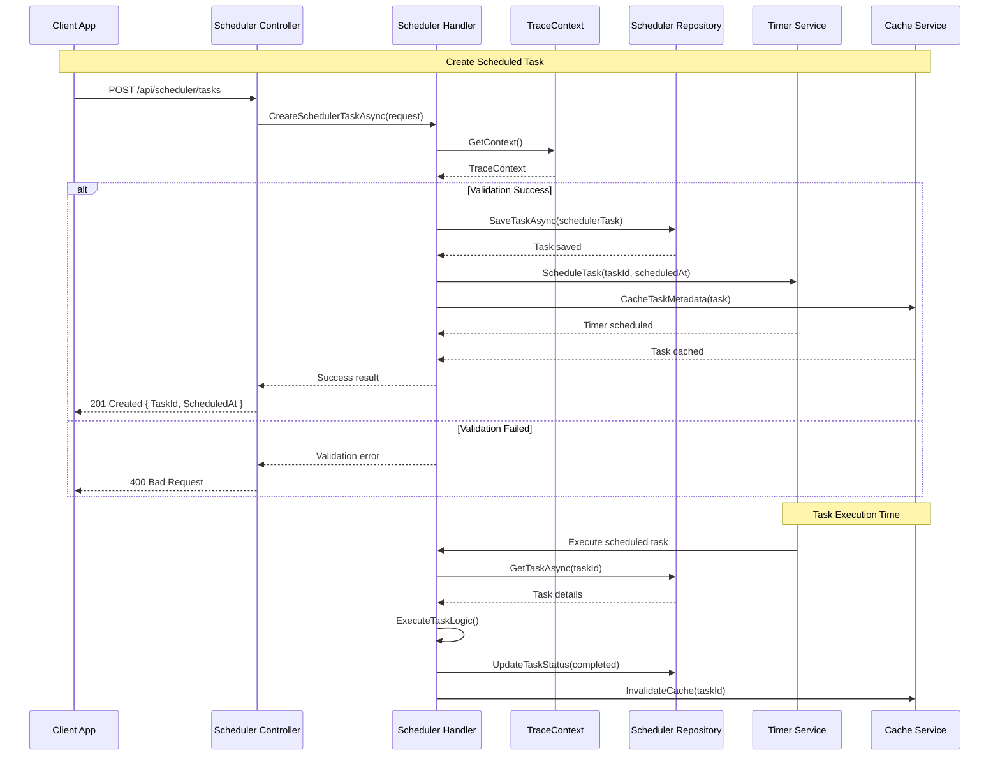

# MQ Platform 集中管理平台 - 系統設計文檔

基於 RabbitMQ 的消息隊列平台，採用 Clean Architecture 設計模式，支援 Event、Task、Scheduler 三種類型的消息處理。

## 系統架構概覽

### MVP 整體架構圖



### 核心元件設計

#### 1. 消息類型架構



## 分層架構設計

### 專案結構
```
src/
└── be/
    ├── EventBus.Infrastructure/              # 基礎設施層 (MVP)
    │   ├── Caching/                         # Memory Cache 服務
    │   ├── TraceContext/                    # 追蹤內容管理
    │   ├── Queuing/                         # .NET Queue 抽象層
    │   ├── Scheduling/                      # Timer 調度服務
    │   └── Extensions/                      # 擴充方法
    ├── EventBus.Platform.WebAPI/           # Web API 層
    │   ├── Controllers/                     # REST 控制器
    │   │   ├── PubController.cs            # 發布 API
    │   │   ├── RegisterController.cs       # 註冊 API
    │   │   └── CallbackController.cs       # 回調 API
    │   ├── Handlers/                        # 業務處理器
    │   │   ├── EventHandler.cs             # 事件處理
    │   │   ├── TaskHandler.cs              # 任務處理
    │   │   ├── SchedulerHandler.cs         # 調度處理
    │   │   └── QueueHandler.cs             # 隊列管理
    │   ├── Repositories/                    # 資料存取
    │   │   ├── EventRepository.cs
    │   │   ├── TaskRepository.cs
    │   │   ├── SubscriptionRepository.cs
    │   │   └── QueueConfigRepository.cs
    │   └── Models/                          # 資料模型
    ├── EventBus.Platform.DB/               # 資料庫層
    │   └── AutoGenerated/                   # EF Core 實體
    ├── EventBus.Platform.Contract/          # API 合約
    └── EventBus.Testing.Common/             # 測試工具
```

### Clean Architecture 層級職責

#### 1. WebAPI 層 (Controllers)
負責 HTTP 請求處理、參數驗證、回應轉換

```csharp
[ApiController]
[Route("api/[controller]")]
public class PubControllerImpl(
    EventHandler eventHandler,
    TaskHandler taskHandler,
    SchedulerHandler schedulerHandler,
    ILogger<PubControllerImpl> logger) : ControllerBase, IPubController
{
    public async Task<IActionResult> PublishEventAsync(
        PublishEventRequest request, 
        CancellationToken cancellationToken = default)
    {
        var result = await eventHandler.PublishEventAsync(request, cancellationToken)
            .ConfigureAwait(false);
        return result.ToApiResult();
    }
}
```

#### 2. Handler 層 (Business Logic)
封裝業務邏輯、協調 Repository 和外部服務

```csharp
public class EventHandler(
    EventRepository eventRepository,
    SubscriptionRepository subscriptionRepository,
    IMessageBroker messageBroker,
    ICacheProvider cacheProvider,
    IContextGetter<TraceContext?> traceContextGetter,
    ILogger<EventHandler> logger)
{
    public async Task<Result<EventPublishResponse, Failure>> PublishEventAsync(
        PublishEventRequest request, 
        CancellationToken cancellationToken = default)
    {
        // 業務邏輯實作
    }
}
```

#### 3. Repository 層 (Data Access)
資料持久化、查詢優化、快取整合

```csharp
public class EventRepository(
    DbContext dbContext,
    ICacheProvider cacheProvider,
    ILogger<EventRepository> logger)
{
    public async Task<Result<Event, Failure>> CreateEventAsync(
        Event eventEntity, 
        CancellationToken cancellationToken = default)
    {
        // 資料存取實作
    }
}
```

## 核心功能設計

### 1. Event 發布與訂閱機制

#### Event 發布流程（含 TraceContext）


#### 訂閱管理
```csharp
public record SubscriptionConfig
{
    public string EventType { get; init; }
    public string SubscriberId { get; init; }
    public string CallbackUrl { get; init; }
    public Dictionary<string, string> Headers { get; init; } = new();
    public int MaxRetries { get; init; } = 3;
    public TimeSpan Timeout { get; init; } = TimeSpan.FromSeconds(30);
    public bool IsActive { get; init; } = true;
}
```

### 2. Task 處理機制

#### 立即執行 Task
```csharp
public record TaskRequest
{
    public string CallbackUrl { get; init; }
    public HttpMethod Method { get; init; } = HttpMethod.Post;
    public object RequestPayload { get; init; }
    public Dictionary<string, string> Headers { get; init; } = new();
    public int MaxRetries { get; init; } = 3;
    public TimeSpan Timeout { get; init; } = TimeSpan.FromSeconds(30);
    public string? TraceId { get; init; }
}
```

#### Task 執行流程（含 TraceContext）


### 3. Scheduler 延遲執行

#### 延遲任務設計
```csharp
public record SchedulerTaskRequest : TaskRequest
{
    public DateTime? ScheduledAt { get; init; }
    public TimeSpan? Delay { get; init; }
    public bool IsRecurring { get; init; } = false;
    public string? CronExpression { get; init; }
}
```

#### 調度器實作


### 4. Queue 管理機制

#### Queue 配置
```csharp
public record QueueConfig
{
    public string QueueName { get; init; }
    public string ExchangeName { get; init; }
    public string RoutingKey { get; init; }
    public bool Durable { get; init; } = true;
    public bool AutoDelete { get; init; } = false;
    public Dictionary<string, object> Arguments { get; init; } = new();
    public int MaxLength { get; init; } = 10000;
    public TimeSpan MessageTTL { get; init; } = TimeSpan.FromHours(24);
}
```

#### 隊列操作流程


#### 快取管理流程


#### 動態隊列管理
- 支援運行時建立、修改、刪除隊列
- 自動配置 DLQ (Dead Letter Queue)
- 支援優先級隊列和延遲隊列

### 5. 健康檢查與監控機制

#### 健康檢查流程


### 6. 完整的 Scheduler 調度流程

#### Scheduler 任務創建與執行


## 監控與 SLO 設計

### 1. 執行時間追蹤

#### 時間指標收集
```csharp
public record ExecutionMetrics
{
    public string TaskId { get; init; }
    public DateTime StartedAt { get; init; }
    public DateTime? CompletedAt { get; init; }
    public TimeSpan? Duration { get; init; }
    public ExecutionStatus Status { get; init; }
    public string? ErrorMessage { get; init; }
    public int RetryCount { get; init; }
    public string TraceId { get; init; }
}
```

### 2. SLO 配置與監控

#### SLO 配置模型
```csharp
public record SLOConfig
{
    public string ServiceName { get; init; }
    public TimeSpan MaxExecutionTime { get; init; }
    public double SuccessRate { get; init; } = 0.99; // 99%
    public int ErrorBudget { get; init; } = 100;
    public TimeSpan MonitoringWindow { get; init; } = TimeSpan.FromMinutes(5);
    public List<AlertRule> AlertRules { get; init; } = new();
}
```

#### 監控指標
- **延遲指標**: P50, P95, P99 回應時間
- **可用性**: 成功率、錯誤率
- **吞吐量**: 每秒處理消息數
- **資源使用**: CPU、記憶體、連線數

### 3. 健康檢查端點

```csharp
public class HealthController : ControllerBase
{
    [HttpGet("/health")]
    public async Task<IActionResult> GetHealthAsync()
    {
        // 完整健康檢查
    }

    [HttpGet("/health/ready")]
    public async Task<IActionResult> GetReadinessAsync()
    {
        // 就緒性檢查 (DB、Cache、RabbitMQ)
    }

    [HttpGet("/health/live")]
    public IActionResult GetLivenessAsync()
    {
        // 存活性檢查
    }
}
```

## 安全性設計

### 1. 身份驗證與授權
- JWT Token 驗證
- API Key 認證支援
- Role-based 存取控制

### 2. 資料保護
- 敏感資料加密儲存
- HTTP Headers 過濾
- Callback URL 白名單驗證

### 3. 追蹤與稽核
- 完整的 TraceId 追蹤
- 結構化日誌記錄
- 敏感操作稽核紀錄

## 效能與擴展設計

### 1. 水平擴展支援
- 無狀態 API 設計
- RabbitMQ Cluster 支援
- Redis Cluster 快取

### 2. 效能優化
- 非同步處理管道
- 連線池管理
- 批量處理支援

### 3. 容錯機制
- Circuit Breaker 模式
- 重試機制
- 降級處理策略

## 部署架構

### 1. 容器化部署
```yaml
version: '3.8'
services:
  eventbus-api:
    image: eventbus-platform:latest
    ports:
      - "5000:5000"
    environment:
      - ASPNETCORE_ENVIRONMENT=Production
      - ConnectionStrings__Default=${DB_CONNECTION}
      - Redis__ConnectionString=${REDIS_CONNECTION}
      - RabbitMQ__ConnectionString=${RABBITMQ_CONNECTION}

  rabbitmq:
    image: rabbitmq:3.11-management
    ports:
      - "5672:5672"
      - "15672:15672"

  redis:
    image: redis:7-alpine
    ports:
      - "6379:6379"

  postgres:
    image: postgres:15
    environment:
      - POSTGRES_DB=eventbus
      - POSTGRES_USER=${DB_USER}
      - POSTGRES_PASSWORD=${DB_PASSWORD}
```

### 2. 監控整合
- Application Insights / Prometheus
- Grafana 儀表板
- ELK Stack 日誌分析

## 測試策略

### 1. 單元測試
- Handler 業務邏輯測試
- Repository 資料存取測試
- Utility 功能測試

### 2. 整合測試
- API 端對端測試
- RabbitMQ 消息流程測試
- 資料庫互動測試

### 3. 效能測試
- 負載測試 (每秒 1000+ 消息)
- 壓力測試
- 延遲測試

## 開發工作流程

### 1. API-First 開發
1. 設計 OpenAPI 規格
2. 產生 Controller 介面
3. 實作 Handler 業務邏輯
4. 撰寫單元測試
5. 整合測試驗證

### 2. 程式碼產生流程
```bash
# 更新 API 規格
task codegen-api

# 產生 EF Core 實體
task ef-codegen

# 執行完整測試
task test-all
```

## 風險評估與緩解

### 1. 技術風險
- **RabbitMQ 單點故障**: 使用 Cluster 模式部署
- **資料庫效能瓶頸**: 讀寫分離、分片策略
- **快取失效**: Redis Cluster + 降級機制

### 2. 業務風險
- **消息遺失**: 持久化設定 + 確認機制
- **重複處理**: 冪等性設計
- **回調失敗**: 重試機制 + DLQ 處理

### 3. 安全風險
- **未授權存取**: JWT + API Key 雙重驗證
- **資料洩漏**: 欄位級加密 + 存取日誌
- **DoS 攻擊**: Rate Limiting + 流量控制

---

此設計文檔提供了 MQ Platform 的完整系統架構，遵循 Clean Architecture 原則和專案編碼標準，確保系統的可維護性、擴展性和可靠性。