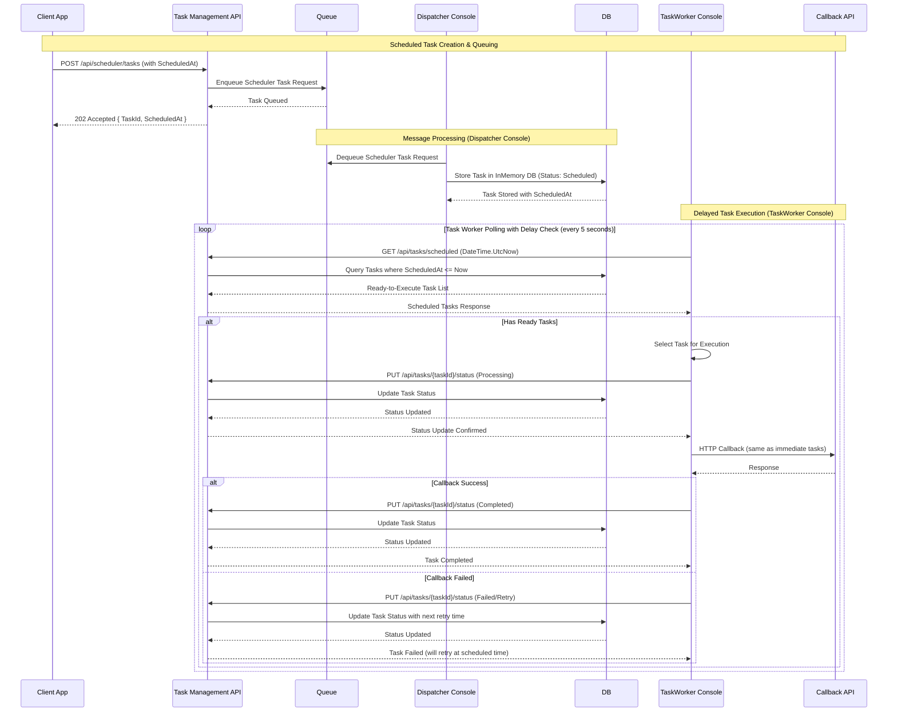

# MQ Platform 集中管理平台 - 系統設計文檔

基於 RabbitMQ 的消息隊列平台，採用 Clean Architecture 設計模式，支援 Event、Task、Scheduler 三種類型的消息處理。

## 系統架構概覽

### MVP 整體架構圖


### 核心元件設計

#### 1. 消息類型架構


## 分層架構設計

### 專案結構
```
src/
└── be/
    ├── EventBus.Infrastructure/              # 基礎設施層 (MVP)
    │   ├── Caching/                         # Memory Cache 服務
    │   ├── TraceContext/                    # 追蹤內容管理
    │   ├── Queuing/                         # .NET Queue 抽象層
    │   ├── Scheduling/                      # Timer 調度服務
    │   └── Extensions/                      # 擴充方法
    ├── EventBus.Platform.WebAPI/           # Web API 層
    │   ├── Controllers/                     # REST 控制器
    │   │   ├── TaskManagementController.cs # Task Management API
    │   │   ├── RegisterController.cs       # 註冊 API
    │   │   └── CallbackController.cs       # 回調 API
    │   ├── Handlers/                        # 業務處理器
    │   │   ├── EventHandler.cs             # 事件處理
    │   │   ├── SchedulerHandler.cs         # 調度處理
    │   │   └── QueueHandler.cs             # 隊列管理
    │   ├── Services/                        # 背景服務
    │   │   ├── TaskWorkerService.cs        # Task 背景執行服務
    │   │   └── MessageDispatcherService.cs # 消息派發服務
    │   ├── Repositories/                    # 資料存取
    │   │   ├── EventRepository.cs
    │   │   ├── TaskRepository.cs
    │   │   ├── SubscriptionRepository.cs
    │   │   └── QueueConfigRepository.cs
    │   └── Models/                          # 資料模型
    ├── EventBus.Platform.DB/               # 資料庫層
    │   └── AutoGenerated/                   # EF Core 實體
    ├── EventBus.Platform.Contract/          # API 合約
    └── EventBus.Testing.Common/             # 測試工具
```

### Clean Architecture 層級職責

#### 1. WebAPI 層 (Controllers)
負責 HTTP 請求處理、參數驗證、回應轉換

```csharp
[ApiController]
[Route("api/[controller]")]
public class TaskManagementController(
    EventHandler eventHandler,
    SchedulerHandler schedulerHandler,
    TaskHandler taskHandler,
    IQueueService queueService,
    ILogger<TaskManagementController> logger) : ControllerBase
{
    [HttpPost("events")]
    public async Task<IActionResult> PublishEventAsync(
        PublishEventRequest request, 
        CancellationToken cancellationToken = default)
    {
        var result = await eventHandler.PublishEventAsync(request, cancellationToken)
            .ConfigureAwait(false);
        return result.ToApiResult();
    }

    [HttpPost("tasks")]
    public async Task<IActionResult> CreateTaskAsync(
        TaskRequest request, 
        CancellationToken cancellationToken = default)
    {
        // 直接將任務放入隊列，由背景服務處理
        var taskId = Guid.NewGuid().ToString();
        await queueService.EnqueueTaskAsync(request with { TaskId = taskId }, cancellationToken);
        
        return Accepted(new { TaskId = taskId });
    }

    [HttpGet("tasks/pending")]
    public async Task<IActionResult> GetPendingTasksAsync(
        CancellationToken cancellationToken = default)
    {
        var result = await taskHandler.GetPendingTasksAsync(cancellationToken)
            .ConfigureAwait(false);
        return result.ToApiResult();
    }

    [HttpPut("tasks/{taskId}/status")]
    public async Task<IActionResult> UpdateTaskStatusAsync(
        string taskId,
        [FromBody] UpdateTaskStatusRequest request,
        CancellationToken cancellationToken = default)
    {
        var result = await taskHandler.UpdateTaskStatusAsync(taskId, request.Status, cancellationToken)
            .ConfigureAwait(false);
        return result.ToApiResult();
    }

    [HttpGet("tasks/{taskId}")]
    public async Task<IActionResult> GetTaskAsync(
        string taskId,
        CancellationToken cancellationToken = default)
    {
        var result = await taskHandler.GetTaskAsync(taskId, cancellationToken)
            .ConfigureAwait(false);
        return result.ToApiResult();
    }
}

public record UpdateTaskStatusRequest
{
    public MessageStatus Status { get; init; }
    public string? ErrorMessage { get; init; }
}
```

#### 2. Handler 層 (Business Logic)
封裝業務邏輯、協調 Repository 和外部服務

```csharp
public class EventHandler(
    EventRepository eventRepository,
    SubscriptionRepository subscriptionRepository,
    IMessageDispatcher messageDispatcher,
    ICacheProvider cacheProvider,
    IContextGetter<TraceContext?> traceContextGetter,
    ILogger<EventHandler> logger)
{
    public async Task<Result<EventPublishResponse, Failure>> PublishEventAsync(
        PublishEventRequest request, 
        CancellationToken cancellationToken = default)
    {
        // 業務邏輯實作
    }
}

public class TaskHandler(
    TaskRepository taskRepository,
    ICacheProvider cacheProvider,
    IContextGetter<TraceContext?> traceContextGetter,
    ILogger<TaskHandler> logger)
{
    public async Task<Result<List<TaskDto>, Failure>> GetPendingTasksAsync(
        CancellationToken cancellationToken = default)
    {
        try
        {
            var traceContext = traceContextGetter.GetContext();
            logger.LogInformation("Getting pending tasks. TraceId: {TraceId}", traceContext?.TraceId);

            // 先從快取查詢
            var cacheKey = "pending_tasks";
            var cachedTasks = await cacheProvider.GetAsync<List<TaskDto>>(cacheKey, cancellationToken);
            
            if (cachedTasks != null && cachedTasks.Count > 0)
            {
                logger.LogDebug("Found {Count} pending tasks in cache", cachedTasks.Count);
                return Result.Success(cachedTasks);
            }

            // 從資料庫查詢
            var tasks = await taskRepository.GetPendingTasksAsync(cancellationToken);
            
            if (tasks.IsSuccess)
            {
                var taskDtos = tasks.Value.Select(t => new TaskDto
                {
                    Id = t.Id,
                    CallbackUrl = t.CallbackUrl,
                    RequestPayload = t.RequestPayload,
                    RetryCount = t.RetryCount,
                    MaxRetries = t.MaxRetries,
                    Headers = t.Headers
                }).ToList();

                // 快取結果（短時間）
                await cacheProvider.SetAsync(cacheKey, taskDtos, TimeSpan.FromMinutes(1), cancellationToken);
                
                return Result.Success(taskDtos);
            }

            return Result.Failure<List<TaskDto>>(tasks.Error);
        }
        catch (Exception ex)
        {
            logger.LogError(ex, "Failed to get pending tasks");
            return Result.Failure<List<TaskDto>>(new Failure("TASK_QUERY_FAILED", ex.Message));
        }
    }

    public async Task<Result<Unit, Failure>> UpdateTaskStatusAsync(
        string taskId, 
        MessageStatus status, 
        CancellationToken cancellationToken = default)
    {
        try
        {
            var traceContext = traceContextGetter.GetContext();
            logger.LogInformation("Updating task {TaskId} status to {Status}. TraceId: {TraceId}", 
                taskId, status, traceContext?.TraceId);

            var result = await taskRepository.UpdateTaskStatusAsync(taskId, status, cancellationToken);
            
            if (result.IsSuccess)
            {
                // 清除相關快取
                await cacheProvider.RemoveAsync("pending_tasks", cancellationToken);
                await cacheProvider.RemoveAsync($"task_{taskId}", cancellationToken);
                
                logger.LogInformation("Task {TaskId} status updated successfully", taskId);
            }

            return result;
        }
        catch (Exception ex)
        {
            logger.LogError(ex, "Failed to update task {TaskId} status", taskId);
            return Result.Failure<Unit>(new Failure("TASK_UPDATE_FAILED", ex.Message));
        }
    }

    public async Task<Result<TaskDto, Failure>> GetTaskAsync(
        string taskId, 
        CancellationToken cancellationToken = default)
    {
        try
        {
            var traceContext = traceContextGetter.GetContext();
            logger.LogInformation("Getting task {TaskId}. TraceId: {TraceId}", taskId, traceContext?.TraceId);

            // 先從快取查詢
            var cacheKey = $"task_{taskId}";
            var cachedTask = await cacheProvider.GetAsync<TaskDto>(cacheKey, cancellationToken);
            
            if (cachedTask != null)
            {
                logger.LogDebug("Found task {TaskId} in cache", taskId);
                return Result.Success(cachedTask);
            }

            // 從資料庫查詢
            var task = await taskRepository.GetTaskAsync(taskId, cancellationToken);
            
            if (task.IsSuccess)
            {
                var taskDto = new TaskDto
                {
                    Id = task.Value.Id,
                    CallbackUrl = task.Value.CallbackUrl,
                    RequestPayload = task.Value.RequestPayload,
                    RetryCount = task.Value.RetryCount,
                    MaxRetries = task.Value.MaxRetries,
                    Headers = task.Value.Headers
                };

                // 快取結果
                await cacheProvider.SetAsync(cacheKey, taskDto, TimeSpan.FromMinutes(5), cancellationToken);
                
                return Result.Success(taskDto);
            }

            return Result.Failure<TaskDto>(task.Error);
        }
        catch (Exception ex)
        {
            logger.LogError(ex, "Failed to get task {TaskId}", taskId);
            return Result.Failure<TaskDto>(new Failure("TASK_GET_FAILED", ex.Message));
        }
    }
}
```

#### 3. 背景服務層 (Background Services)
處理長時間執行的任務和消息處理

```csharp
public class MessageDispatcherService : BackgroundService
{
    private readonly IQueueService _queueService;
    private readonly TaskRepository _taskRepository;

    protected override async Task ExecuteAsync(CancellationToken stoppingToken)
    {
        while (!stoppingToken.IsCancellationRequested)
        {
            // 從隊列取出任務並存入資料庫
            var taskRequest = await _queueService.DequeueTaskAsync(stoppingToken);
            if (taskRequest != null)
            {
                await _taskRepository.CreateTaskAsync(taskRequest, stoppingToken);
            }
            
            await Task.Delay(TimeSpan.FromSeconds(1), stoppingToken);
        }
    }
}
```

#### 4. Repository 層 (Data Access)
資料持久化、查詢優化、快取整合

```csharp
public class EventRepository(
    DbContext dbContext,
    ICacheProvider cacheProvider,
    ILogger<EventRepository> logger)
{
    public async Task<Result<Event, Failure>> CreateEventAsync(
        Event eventEntity, 
        CancellationToken cancellationToken = default)
    {
        // 資料存取實作
    }
}
```

## 核心功能設計

### 1. Task 處理機制

#### 立即執行 Task
```csharp
public record TaskRequest
{
    public string CallbackUrl { get; init; }
    public HttpMethod Method { get; init; } = HttpMethod.Post;
    public object RequestPayload { get; init; }
    public Dictionary<string, string> Headers { get; init; } = new();
    public int MaxRetries { get; init; } = 3;
    public TimeSpan Timeout { get; init; } = TimeSpan.FromSeconds(30);
    public string? TraceId { get; init; }
}
```

#### Task 執行流程


#### TaskWorker Console 應用程式設計

```csharp
// Program.cs - TaskWorker Console Application
using Microsoft.Extensions.Configuration;
using Microsoft.Extensions.DependencyInjection;
using Microsoft.Extensions.Hosting;
using Microsoft.Extensions.Logging;
using TaskWorker.Services;

var builder = Host.CreateDefaultBuilder(args);

builder.ConfigureAppConfiguration((context, config) =>
{
    config.AddJsonFile("appsettings.json", optional: true, reloadOnChange: true);
    config.AddJsonFile($"appsettings.{context.HostingEnvironment.EnvironmentName}.json", optional: true);
    config.AddEnvironmentVariables();
});

builder.ConfigureServices((context, services) =>
{
    services.AddLogging(logging =>
    {
        logging.ClearProviders();
        logging.AddConsole();
        logging.SetMinimumLevel(LogLevel.Information);
    });

    // HTTP Client for API communication
    services.AddHttpClient();
    
    // Task Worker Service
    services.AddHostedService<TaskWorkerService>();
});

using var host = builder.Build();

var logger = host.Services.GetRequiredService<ILogger<Program>>();
logger.LogInformation("TaskWorker Console Application starting...");

try
{
    await host.RunAsync();
}
catch (Exception ex)
{
    logger.LogCritical(ex, "TaskWorker terminated unexpectedly");
}
finally
{
    logger.LogInformation("TaskWorker Console Application stopped");
}

// TaskWorkerService.cs - HTTP API based Task Worker
public class TaskWorkerService : BackgroundService
{
    private readonly IHttpClientFactory _httpClientFactory;
    private readonly ILogger<TaskWorkerService> _logger;
    private readonly IConfiguration _configuration;
    private readonly TimeSpan _pollingInterval = TimeSpan.FromSeconds(5);
    private readonly string _taskApiBaseUrl;

    public TaskWorkerService(
        IHttpClientFactory httpClientFactory,
        ILogger<TaskWorkerService> logger,
        IConfiguration configuration)
    {
        _httpClientFactory = httpClientFactory;
        _logger = logger;
        _configuration = configuration;
        _taskApiBaseUrl = configuration.GetValue<string>("TaskApi:BaseUrl") ?? "http://localhost:5000";
    }

    protected override async Task ExecuteAsync(CancellationToken stoppingToken)
    {
        _logger.LogInformation("TaskWorker started - polling interval: {PollingInterval}s, API: {ApiUrl}", 
            _pollingInterval.TotalSeconds, _taskApiBaseUrl);

        while (!stoppingToken.IsCancellationRequested)
        {
            try
            {
                // 透過 HTTP API 查詢待執行的任務
                var pendingTasks = await GetPendingTasksViaApiAsync(stoppingToken);

                if (pendingTasks?.Any() == true)
                {
                    _logger.LogDebug("Found {TaskCount} pending tasks", pendingTasks.Count);

                    // 並發處理任務（限制並發數）
                    var semaphore = new SemaphoreSlim(5, 5);
                    var tasks = pendingTasks.Select(task => ProcessTaskViaApiAsync(task, semaphore, stoppingToken));
                    
                    await Task.WhenAll(tasks);
                }

                await Task.Delay(_pollingInterval, stoppingToken);
            }
            catch (Exception ex)
            {
                _logger.LogError(ex, "TaskWorker execution failed");
                await Task.Delay(TimeSpan.FromSeconds(30), stoppingToken);
            }
        }

        _logger.LogInformation("TaskWorker stopped");
    }

    private async Task<List<TaskResponse>?> GetPendingTasksViaApiAsync(CancellationToken cancellationToken)
    {
        try
        {
            using var httpClient = _httpClientFactory.CreateClient();
            httpClient.BaseAddress = new Uri(_taskApiBaseUrl);
            httpClient.DefaultRequestHeaders.Add("User-Agent", "TaskWorker/1.0");
            
            var response = await httpClient.GetFromJsonAsync<TaskApiResponse>(
                "/api/tasks/pending?limit=50", cancellationToken);
                
            return response?.Tasks;
        }
        catch (Exception ex)
        {
            _logger.LogError(ex, "Failed to retrieve pending tasks via API");
            return null;
        }
    }

    private async Task ProcessTaskViaApiAsync(TaskResponse task, SemaphoreSlim semaphore, CancellationToken cancellationToken)
    {
        await semaphore.WaitAsync(cancellationToken);
        try
        {
            await ExecuteTaskViaApiAsync(task, cancellationToken);
        }
        finally
        {
            semaphore.Release();
        }
    }

    private async Task ExecuteTaskViaApiAsync(TaskResponse task, CancellationToken cancellationToken)
    {
        var taskId = task.Id;
        var startTime = DateTime.UtcNow;

        _logger.LogInformation("Starting task execution: {TaskId}, CallbackUrl: {CallbackUrl} - TraceId: {TraceId}",
            taskId, task.CallbackUrl, task.TraceId);

        try
        {
            // 透過 API 更新任務狀態為處理中
            var processingSuccess = await UpdateTaskStatusViaApiAsync(taskId, "Processing", null, cancellationToken);
            if (!processingSuccess)
            {
                _logger.LogError("Failed to update task status to Processing: {TaskId}", taskId);
                return;
            }

            // 執行 HTTP 回調
            var success = await ExecuteHttpCallbackAsync(task, cancellationToken);

            if (success)
            {
                var completedSuccess = await UpdateTaskStatusViaApiAsync(taskId, "Completed", null, cancellationToken);
                if (completedSuccess)
                {
                    var duration = DateTime.UtcNow - startTime;
                    _logger.LogInformation("Task completed successfully: {TaskId} in {Duration}ms - TraceId: {TraceId}",
                        taskId, duration.TotalMilliseconds, task.TraceId);
                }
            }
            else
            {
                await HandleTaskFailureViaApiAsync(task, "HTTP callback failed", cancellationToken);
            }
        }
        catch (Exception ex)
        {
            _logger.LogError(ex, "Exception during task execution: {TaskId} - TraceId: {TraceId}",
                taskId, task.TraceId);
            
            await HandleTaskFailureViaApiAsync(task, ex.Message, cancellationToken);
        }
    }

    private async Task<bool> ExecuteHttpCallbackAsync(TaskResponse task, CancellationToken cancellationToken)
    {
        try
        {
            using var httpClient = _httpClientFactory.CreateClient();
            httpClient.Timeout = TimeSpan.FromSeconds(task.TimeoutSeconds);

            var httpMethod = GetHttpMethod(task.Method);
            using var request = new HttpRequestMessage(httpMethod, task.CallbackUrl);

            // 添加自訂 Headers
            if (task.Headers != null)
            {
                foreach (var header in task.Headers)
                {
                    request.Headers.TryAddWithoutValidation(header.Key, header.Value);
                }
            }

            // 添加 TraceId Header
            if (!string.IsNullOrWhiteSpace(task.TraceId))
            {
                request.Headers.TryAddWithoutValidation("X-Trace-Id", task.TraceId);
            }

            // 設定請求內容
            if (httpMethod != HttpMethod.Get && !string.IsNullOrWhiteSpace(task.RequestPayload))
            {
                try
                {
                    var jsonElement = JsonSerializer.Deserialize<JsonElement>(task.RequestPayload);
                    request.Content = JsonContent.Create(jsonElement);
                }
                catch (JsonException)
                {
                    request.Content = new StringContent(task.RequestPayload, Encoding.UTF8, "text/plain");
                }
            }

            using var response = await httpClient.SendAsync(request, cancellationToken);
            var isSuccess = response.IsSuccessStatusCode;

            _logger.LogDebug("HTTP callback response: {TaskId} -> {StatusCode} - TraceId: {TraceId}",
                task.Id, (int)response.StatusCode, task.TraceId);

            return isSuccess;
        }
        catch (Exception ex)
        {
            _logger.LogError(ex, "HTTP callback execution failed: {TaskId} - TraceId: {TraceId}",
                task.Id, task.TraceId);
            return false;
        }
    }

    private async Task<bool> UpdateTaskStatusViaApiAsync(string taskId, string status, string? errorMessage, CancellationToken cancellationToken)
    {
        try
        {
            using var httpClient = _httpClientFactory.CreateClient();
            httpClient.BaseAddress = new Uri(_taskApiBaseUrl);
            
            var request = new UpdateTaskStatusRequest
            {
                Status = status,
                ErrorMessage = errorMessage
            };
            
            var response = await httpClient.PutAsJsonAsync(
                $"/api/tasks/{taskId}/status", request, cancellationToken);
                
            return response.IsSuccessStatusCode;
        }
        catch (Exception ex)
        {
            _logger.LogError(ex, "Failed to update task status via API: {TaskId} -> {Status}", taskId, status);
            return false;
        }
    }

    private async Task HandleTaskFailureViaApiAsync(TaskResponse task, string errorMessage, CancellationToken cancellationToken)
    {
        var taskId = task.Id;
        var currentRetryCount = task.RetryCount + 1;

        if (currentRetryCount <= task.MaxRetries)
        {
            var retryMessage = $"Retry {currentRetryCount}/{task.MaxRetries}: {errorMessage}";
            var success = await UpdateTaskStatusViaApiAsync(taskId, "Pending", retryMessage, cancellationToken);

            if (success)
            {
                _logger.LogWarning("Task marked for retry: {TaskId} ({RetryCount}/{MaxRetries}) - TraceId: {TraceId}",
                    taskId, currentRetryCount, task.MaxRetries, task.TraceId);
            }
        }
        else
        {
            var failureMessage = $"Max retries exceeded: {errorMessage}";
            var success = await UpdateTaskStatusViaApiAsync(taskId, "Failed", failureMessage, cancellationToken);

            if (success)
            {
                _logger.LogError("Task failed permanently: {TaskId} after {MaxRetries} retries - TraceId: {TraceId}",
                    taskId, task.MaxRetries, task.TraceId);
            }
        }
    }

    private static HttpMethod GetHttpMethod(string method)
    {
        return method?.ToUpperInvariant() switch
        {
            "GET" => HttpMethod.Get,
            "POST" => HttpMethod.Post,
            "PUT" => HttpMethod.Put,
            "DELETE" => HttpMethod.Delete,
            "PATCH" => HttpMethod.Patch,
            "HEAD" => HttpMethod.Head,
            "OPTIONS" => HttpMethod.Options,
            _ => HttpMethod.Post
        };
    }
}

// Supporting Models
public class TaskApiResponse
{
    public List<TaskResponse> Tasks { get; set; } = new();
    public int Count { get; set; }
    public int Limit { get; set; }
}

public record UpdateTaskStatusRequest
{
    public string Status { get; init; } = string.Empty;
    public string? ErrorMessage { get; init; }
}
```

### 2. Event 發布與訂閱機制

#### Event 發布流程（含 TraceContext）


#### 訂閱管理
```csharp
public record SubscriptionConfig
{
    public string EventType { get; init; }
    public string SubscriberId { get; init; }
    public string CallbackUrl { get; init; }
    public Dictionary<string, string> Headers { get; init; } = new();
    public int MaxRetries { get; init; } = 3;
    public TimeSpan Timeout { get; init; } = TimeSpan.FromSeconds(30);
    public bool IsActive { get; init; } = true;
}
```

### 3. Scheduler 延遲執行

#### 延遲任務設計
延遲執行任務採用與立即執行任務相同的工作流程，差別在於任務建立時需要指定執行時間，並由 TaskWorker Console 實作延遲執行功能。

```csharp
public record SchedulerTaskRequest : TaskRequest
{
    public DateTime? ScheduledAt { get; init; }
    public TimeSpan? Delay { get; init; }
    public bool IsRecurring { get; init; } = false;
    public string? CronExpression { get; init; }
}
```

#### 延遲任務執行流程


### 4. Queue 管理機制

#### Queue 配置
```csharp
public record QueueConfig
{
    public string QueueName { get; init; }
    public string ExchangeName { get; init; }
    public string RoutingKey { get; init; }
    public bool Durable { get; init; } = true;
    public bool AutoDelete { get; init; } = false;
    public Dictionary<string, object> Arguments { get; init; } = new();
    public int MaxLength { get; init; } = 10000;
    public TimeSpan MessageTTL { get; init; } = TimeSpan.FromHours(24);
}
```

#### 隊列操作流程


#### 快取管理流程


#### 動態隊列管理
- 支援運行時建立、修改、刪除隊列
- 自動配置 DLQ (Dead Letter Queue)
- 支援優先級隊列和延遲隊列

### 5. 健康檢查與監控機制

#### 健康檢查流程


#### TaskWorker Console 延遲執行實作

```csharp
// Enhanced TaskWorkerService.cs - 支援延遲執行
public class TaskWorkerService : BackgroundService
{
    private readonly IHttpClientFactory _httpClientFactory;
    private readonly ILogger<TaskWorkerService> _logger;
    private readonly IConfiguration _configuration;
    private readonly TimeSpan _pollingInterval = TimeSpan.FromSeconds(5);
    private readonly string _taskApiBaseUrl;

    protected override async Task ExecuteAsync(CancellationToken stoppingToken)
    {
        _logger.LogInformation("TaskWorker started with delayed execution support - polling interval: {PollingInterval}s", 
            _pollingInterval.TotalSeconds);

        while (!stoppingToken.IsCancellationRequested)
        {
            try
            {
                // 查詢立即執行的待處理任務
                var pendingTasks = await GetPendingTasksViaApiAsync(stoppingToken);
                
                // 查詢已到執行時間的延遲任務
                var scheduledTasks = await GetScheduledTasksViaApiAsync(DateTime.UtcNow, stoppingToken);

                var allTasks = new List<TaskResponse>();
                if (pendingTasks?.Any() == true) allTasks.AddRange(pendingTasks);
                if (scheduledTasks?.Any() == true) allTasks.AddRange(scheduledTasks);

                if (allTasks.Any())
                {
                    _logger.LogDebug("Found {PendingCount} pending tasks and {ScheduledCount} scheduled tasks ready to execute", 
                        pendingTasks?.Count ?? 0, scheduledTasks?.Count ?? 0);

                    // 並發處理任務（限制並發數）
                    var semaphore = new SemaphoreSlim(5, 5);
                    var tasks = allTasks.Select(task => ProcessTaskViaApiAsync(task, semaphore, stoppingToken));
                    
                    await Task.WhenAll(tasks);
                }

                await Task.Delay(_pollingInterval, stoppingToken);
            }
            catch (Exception ex)
            {
                _logger.LogError(ex, "TaskWorker execution failed");
                await Task.Delay(TimeSpan.FromSeconds(30), stoppingToken);
            }
        }

        _logger.LogInformation("TaskWorker stopped");
    }

    private async Task<List<TaskResponse>?> GetScheduledTasksViaApiAsync(DateTime currentTime, CancellationToken cancellationToken)
    {
        try
        {
            using var httpClient = _httpClientFactory.CreateClient();
            httpClient.BaseAddress = new Uri(_taskApiBaseUrl);
            httpClient.DefaultRequestHeaders.Add("User-Agent", "TaskWorker/1.0");
            
            var response = await httpClient.GetFromJsonAsync<TaskApiResponse>(
                $"/api/tasks/scheduled?currentTime={currentTime:yyyy-MM-ddTHH:mm:ss.fffZ}&limit=50", cancellationToken);
                
            return response?.Tasks;
        }
        catch (Exception ex)
        {
            _logger.LogError(ex, "Failed to retrieve scheduled tasks via API");
            return null;
        }
    }

    private async Task HandleScheduledTaskFailureViaApiAsync(TaskResponse task, string errorMessage, CancellationToken cancellationToken)
    {
        var taskId = task.Id;
        var currentRetryCount = task.RetryCount + 1;

        if (currentRetryCount <= task.MaxRetries)
        {
            // 計算下次重試時間（延遲任務的重試也要考慮時間）
            var nextRetryTime = task.ScheduledAt?.AddMinutes(currentRetryCount * 5) ?? DateTime.UtcNow.AddMinutes(currentRetryCount * 5);
            var retryMessage = $"Retry {currentRetryCount}/{task.MaxRetries}: {errorMessage} (Next retry at: {nextRetryTime})";
            
            var success = await UpdateScheduledTaskStatusViaApiAsync(taskId, "Scheduled", retryMessage, nextRetryTime, cancellationToken);

            if (success)
            {
                _logger.LogWarning("Scheduled task marked for retry: {TaskId} ({RetryCount}/{MaxRetries}) at {NextRetry} - TraceId: {TraceId}",
                    taskId, currentRetryCount, task.MaxRetries, nextRetryTime, task.TraceId);
            }
        }
        else
        {
            var failureMessage = $"Max retries exceeded: {errorMessage}";
            var success = await UpdateTaskStatusViaApiAsync(taskId, "Failed", failureMessage, cancellationToken);

            if (success)
            {
                _logger.LogError("Scheduled task failed permanently: {TaskId} after {MaxRetries} retries - TraceId: {TraceId}",
                    taskId, task.MaxRetries, task.TraceId);
            }
        }
    }

    private async Task<bool> UpdateScheduledTaskStatusViaApiAsync(string taskId, string status, string? errorMessage, DateTime? nextScheduledAt, CancellationToken cancellationToken)
    {
        try
        {
            using var httpClient = _httpClientFactory.CreateClient();
            httpClient.BaseAddress = new Uri(_taskApiBaseUrl);
            
            var request = new UpdateScheduledTaskStatusRequest
            {
                Status = status,
                ErrorMessage = errorMessage,
                NextScheduledAt = nextScheduledAt
            };
            
            var response = await httpClient.PutAsJsonAsync(
                $"/api/tasks/scheduled/{taskId}/status", request, cancellationToken);
                
            return response.IsSuccessStatusCode;
        }
        catch (Exception ex)
        {
            _logger.LogError(ex, "Failed to update scheduled task status via API: {TaskId} -> {Status}", taskId, status);
            return false;
        }
    }
}

// Supporting Models for Scheduled Tasks
public class TaskResponse
{
    public string Id { get; set; } = string.Empty;
    public string CallbackUrl { get; set; } = string.Empty;
    public string Method { get; set; } = "POST";
    public string RequestPayload { get; set; } = string.Empty;
    public Dictionary<string, string> Headers { get; set; } = new();
    public int MaxRetries { get; set; } = 3;
    public int RetryCount { get; set; } = 0;
    public int TimeoutSeconds { get; set; } = 30;
    public string? TraceId { get; set; }
    
    // Scheduled task properties
    public DateTime? ScheduledAt { get; set; }
    public bool IsRecurring { get; set; }
    public string? CronExpression { get; set; }
}

public record UpdateScheduledTaskStatusRequest
{
    public string Status { get; init; } = string.Empty;
    public string? ErrorMessage { get; init; }
    public DateTime? NextScheduledAt { get; init; }
}
```

### 6. 完整的 Scheduler 調度流程

#### API 端點擴充支援
```csharp
[ApiController]
[Route("api/[controller]")]
public class TaskManagementController : ControllerBase
{
    [HttpPost("scheduler/tasks")]
    public async Task<IActionResult> CreateSchedulerTaskAsync(
        SchedulerTaskRequest request, 
        CancellationToken cancellationToken = default)
    {
        // 處理延遲任務建立邏輯
        var scheduledAt = request.ScheduledAt ?? DateTime.UtcNow.Add(request.Delay ?? TimeSpan.Zero);
        var taskId = Guid.NewGuid().ToString();
        
        var taskRequest = request with 
        { 
            TaskId = taskId,
            ScheduledAt = scheduledAt 
        };
        
        await queueService.EnqueueSchedulerTaskAsync(taskRequest, cancellationToken);
        
        return Accepted(new { TaskId = taskId, ScheduledAt = scheduledAt });
    }

    [HttpGet("tasks/scheduled")]
    public async Task<IActionResult> GetScheduledTasksAsync(
        [FromQuery] DateTime currentTime,
        [FromQuery] int limit = 50,
        CancellationToken cancellationToken = default)
    {
        var result = await taskHandler.GetScheduledTasksReadyForExecutionAsync(currentTime, limit, cancellationToken)
            .ConfigureAwait(false);
        return result.ToApiResult();
    }

    [HttpPut("tasks/scheduled/{taskId}/status")]
    public async Task<IActionResult> UpdateScheduledTaskStatusAsync(
        string taskId,
        [FromBody] UpdateScheduledTaskStatusRequest request,
        CancellationToken cancellationToken = default)
    {
        var result = await taskHandler.UpdateScheduledTaskStatusAsync(taskId, request, cancellationToken)
            .ConfigureAwait(false);
        return result.ToApiResult();
    }
}
```

## 監控與 SLO 設計

### 1. 執行時間追蹤

#### 時間指標收集
```csharp
public record ExecutionMetrics
{
    public string TaskId { get; init; }
    public DateTime StartedAt { get; init; }
    public DateTime? CompletedAt { get; init; }
    public TimeSpan? Duration { get; init; }
    public ExecutionStatus Status { get; init; }
    public string? ErrorMessage { get; init; }
    public int RetryCount { get; init; }
    public string TraceId { get; init; }
}
```

### 2. SLO 配置與監控

#### SLO 配置模型
```csharp
public record SLOConfig
{
    public string ServiceName { get; init; }
    public TimeSpan MaxExecutionTime { get; init; }
    public double SuccessRate { get; init; } = 0.99; // 99%
    public int ErrorBudget { get; init; } = 100;
    public TimeSpan MonitoringWindow { get; init; } = TimeSpan.FromMinutes(5);
    public List<AlertRule> AlertRules { get; init; } = new();
}
```

#### 監控指標
- **延遲指標**: P50, P95, P99 回應時間
- **可用性**: 成功率、錯誤率
- **吞吐量**: 每秒處理消息數
- **資源使用**: CPU、記憶體、連線數

### 3. 健康檢查端點

```csharp
public class HealthController : ControllerBase
{
    [HttpGet("/health")]
    public async Task<IActionResult> GetHealthAsync()
    {
        // 完整健康檢查
    }

    [HttpGet("/health/ready")]
    public async Task<IActionResult> GetReadinessAsync()
    {
        // 就緒性檢查 (DB、Cache、RabbitMQ)
    }

    [HttpGet("/health/live")]
    public IActionResult GetLivenessAsync()
    {
        // 存活性檢查
    }
}
```

## 安全性設計

### 1. 身份驗證與授權
- JWT Token 驗證
- API Key 認證支援
- Role-based 存取控制

### 2. 資料保護
- 敏感資料加密儲存
- HTTP Headers 過濾
- Callback URL 白名單驗證

### 3. 追蹤與稽核
- 完整的 TraceId 追蹤
- 結構化日誌記錄
- 敏感操作稽核紀錄

## 效能與擴展設計

### 1. 水平擴展支援
- 無狀態 API 設計
- RabbitMQ Cluster 支援
- Redis Cluster 快取

### 2. 效能優化
- 非同步處理管道
- 連線池管理
- 批量處理支援

### 3. 容錯機制
- Circuit Breaker 模式
- 重試機制
- 降級處理策略

## 部署架構

### 1. 容器化部署
```yaml
version: '3.8'
services:
  eventbus-api:
    image: eventbus-platform:latest
    ports:
      - "5000:5000"
    environment:
      - ASPNETCORE_ENVIRONMENT=Production
      - ConnectionStrings__Default=${DB_CONNECTION}
      - Redis__ConnectionString=${REDIS_CONNECTION}
      - RabbitMQ__ConnectionString=${RABBITMQ_CONNECTION}

  rabbitmq:
    image: rabbitmq:3.11-management
    ports:
      - "5672:5672"
      - "15672:15672"

  redis:
    image: redis:7-alpine
    ports:
      - "6379:6379"

  postgres:
    image: postgres:15
    environment:
      - POSTGRES_DB=eventbus
      - POSTGRES_USER=${DB_USER}
      - POSTGRES_PASSWORD=${DB_PASSWORD}
```

### 2. 監控整合
- Application Insights / Prometheus
- Grafana 儀表板
- ELK Stack 日誌分析

## 測試策略

### 1. 單元測試
- Handler 業務邏輯測試
- Repository 資料存取測試
- Utility 功能測試

### 2. 整合測試
- API 端對端測試
- RabbitMQ 消息流程測試
- 資料庫互動測試

### 3. 效能測試
- 負載測試 (每秒 1000+ 消息)
- 壓力測試
- 延遲測試

## 開發工作流程

### 1. API-First 開發
1. 設計 OpenAPI 規格
2. 產生 Controller 介面
3. 實作 Handler 業務邏輯
4. 撰寫單元測試
5. 整合測試驗證

### 2. 程式碼產生流程
```bash
# 更新 API 規格
task codegen-api

# 產生 EF Core 實體
task ef-codegen

# 執行完整測試
task test-all
```

## 風險評估與緩解

### 1. 技術風險
- **RabbitMQ 單點故障**: 使用 Cluster 模式部署
- **資料庫效能瓶頸**: 讀寫分離、分片策略
- **快取失效**: Redis Cluster + 降級機制

### 2. 業務風險
- **消息遺失**: 持久化設定 + 確認機制
- **重複處理**: 冪等性設計
- **回調失敗**: 重試機制 + DLQ 處理

### 3. 安全風險
- **未授權存取**: JWT + API Key 雙重驗證
- **資料洩漏**: 欄位級加密 + 存取日誌
- **DoS 攻擊**: Rate Limiting + 流量控制

---

此設計文檔提供了 MQ Platform 的完整系統架構，遵循 Clean Architecture 原則和專案編碼標準，確保系統的可維護性、擴展性和可靠性。